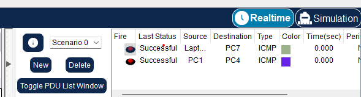
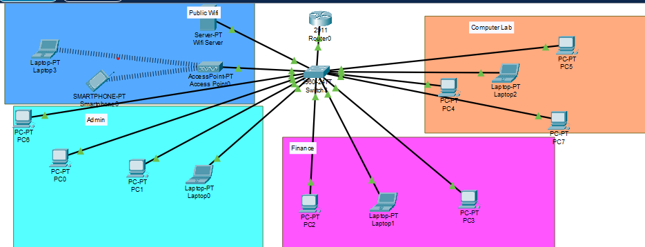
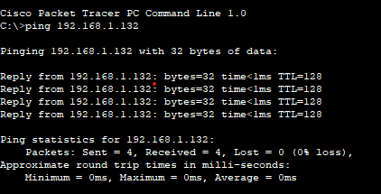
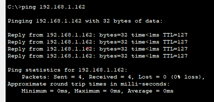
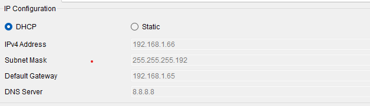
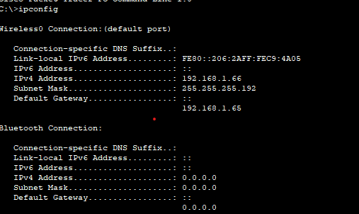

## Multi-Department Enterprice Network

The network used for this project is
**_192.168.1.0/24_**

---

# Design and Simulation of a Secure Multi-Department Enterprise Network Project

## 1. Introduction

This project report documents the design, configuration, and simulation of a secure enterprise network for a small organization with four departments: Administration, Finance, Computer Laboratory, and Public WiFi Users. The network is built using Cisco Packet Tracer and implements key networking concepts including subnetting (VLSM), VLAN segmentation, inter-VLAN routing (Router-on-a-Stick), DHCP for wireless clients, and NAT/PAT for simulated internet access. The allocated IP network is 192.168.1.0/24. The goal is to produce a fully functional, tested, and documented network that meets all specified requirements.

## 2. Network Requirements Analysis

The organization requires separate logical networks for each department to ensure security, broadcast isolation, and efficient management. The minimum host requirements per department are:

Department Minimum Hosts  
Administration 20  
Finance 10  
Computer Laboratory 50  
Public WiFi Users 40

Based on these requirements, the total address space needed is at least 120 hosts. The allocated /24 network provides 254 usable addresses, which is sufficient. However, to efficiently use IP space and accommodate future growth, Variable Length Subnet Masking (VLSM) is employed.

3. IP Addressing Plan (Subnetting Table)
   | Department | Network ID | subnet Mask | Usable range | Broadcast Address | Gateway |
   | -------------- | ---------------- | --------------- | ----------------- | ----------------- | ------------- |
   | Computer lab | 192.168.1.0/26 | 255.255.255.192 | 192.168.1.1-62 | 192.168.1.63 | 192.168.1.1 |
   | Public wifi | 129.168.1.64/26 | 255.255.255.192 | 192.168.1.65-126 | 192.168.1.127 | 192.168.1.65 |
   | Administration | 192.168.1.128/27 | 255.255.255.224 | 192.168.1.129-158 | 192.168.1.159 | 192.168.1.129 |
   | Finance | 192.168.1.160/28 | 255.255.255.240 | 192.168.1.161-174 | 192.168.1.175 | 192.168.1.161 |

## 4. VLAN Design Explanation

VLANs (Virtual Local Area Networks) are used to logically segment the physical network into separate broadcast domains. This improves security (traffic between departments is isolated unless routed), reduces broadcast traffic, and simplifies network management. Each department is assigned a unique VLAN ID:

Department VLAN ID VLAN Name  
Administration 10 Admin  
Finance 20 Finance  
Computer Laboratory 30 Lab  
Public WiFi 40 WiFi

The switch ports are assigned as follows (based on a single switch topology with 24 ports):

Ports Fa0/2 – Fa0/5: VLAN 10 (Admin PCs)

Ports Fa0/6 – Fa0/8: VLAN 20 (Finance PCs)

Ports Fa0/9 – Fa0/12: VLAN 30 (Lab PCs)

Port Fa0/13: VLAN 30 (Server – internal services)

Port Fa0/14: VLAN 40 (Wireless Access Point)

The port connecting the switch to the router (Fa0/1) is configured as a trunk to carry all VLAN traffic. The router then performs inter-VLAN routing using subinterfaces (Router-on-a-Stick).

## 5. Router Configuration Explanation

The router (Cisco 2911) is the gateway for all VLANs and provides routing between them. It also acts as the DHCP server for WiFi clients and performs NAT for internet access.

### 5.1 Subinterfaces for Inter-VLAN Routing

The physical interface GigabitEthernet0/0 is connected to the switch trunk port. Four logical subinterfaces are created, each with:

802.1Q encapsulation matching the VLAN ID

An IP address that serves as the default gateway for that VLAN

Example for VLAN 10 (Admin):

```Router Commands
interface gigabitEthernet 0/0.10
encapsulation dot1Q 10
ip address 192.168.1.129 255.255.255.224
This setup allows the router to receive tagged frames from the switch and route packets between different VLANs.
```

### 5.2 DHCP Service for WiFi Users

The router provides dynamic IP addresses to wireless clients on VLAN 40. The DHCP pool is configured with:

Network: 192.168.1.64/26

Default gateway: 192.168.1.65

DNS server: 8.8.8.8 (public DNS)

The router’s own IP is excluded from the pool to prevent conflicts.

### 5.3 NAT (PAT) for Internet Access

Network Address Translation (Port Address Translation) allows multiple private IP addresses to share a single public IP. The router’s GigabitEthernet0/1 is configured as the outside interface with a public IP (209.165.200.1/30). An access list defines the inside networks (192.168.1.0/24), and NAT overload translates all inside traffic to the outside interface’s IP. This simulates internet access for the enterprise.

## 6. NAT Explanation

NAT (Network Address Translation) is essential because private IP addresses (RFC 1918) cannot be routed on the public internet. In this design, PAT (Port Address Translation), also known as NAT overload, is implemented. It maps multiple private IP addresses to a single public IP by differentiating connections using source port numbers. This conserves public IP addresses and provides a layer of security by hiding internal IP structures from external networks.

The configuration uses:

ip nat inside source list 1 interface gigabitEthernet 0/1 overload

access-list 1 permit 192.168.1.0 0.0.0.255

All outbound traffic from internal VLANs is translated to the router’s public IP. Return traffic is automatically translated back to the correct internal host.

## 7. Testing & Verification



### 7.1 Topology Diagram

!

### 7.2 Within VLAN Ping Test



### 7.3 Across VLAN Ping Test

Ping from Admin PC1 (VLAN 10, 192.168.1.130) to Finance PC1 (VLAN 20, 192.168.1.162) – successful, confirming inter-VLAN routing.


### 7.4 DHCP Address Assignment

On a WiFi laptop connected to the Access Point, run ipconfig (or ifconfig). It shows an IP address in the range 192.168.1.66 – 192.168.1.126, with gateway 192.168.1.65.




## 8. Challenges Encountered

During the configuration and simulation, the following challenges were faced and resolved:

Trunk not passing all VLANs – Initially, the switch trunk port did not allow VLAN 40. The issue was fixed by explicitly allowing all required VLANs using switchport trunk allowed vlan 10,20,30,40.

WiFi clients not obtaining DHCP addresses – The Access Point was not correctly configured to bridge traffic to VLAN 40. After setting the Access Point’s management VLAN to 40 and ensuring the switch port was an access port in VLAN 40, DHCP worked.

Inter-VLAN ping failures – Caused by missing no shutdown on the router’s physical interface and subinterfaces. Once enabled, routing functioned correctly.

NAT not translating pings to external server – The outside interface was not marked with ip nat outside. Adding this command resolved the issue.

## 9. Conclusion

This project successfully designed, configured, and simulated a secure multi-department enterprise network using Cisco Packet Tracer. All requirements were met:

Subnetting using VLSM provided efficient IP allocation.

Four VLANs were created and trunked to the router.

Inter-VLAN routing (Router-on-a-Stick) enabled cross-department communication.

DHCP was configured on the router for WiFi users.

NAT/PAT allowed simulated internet access.

All tests (ping within VLAN, across VLANs, DHCP, NAT) passed.

The network is scalable, secure, and ready for deployment. The hands-on experience reinforced key networking concepts and troubleshooting skills.

[Github Link](https://github.com/PieBerlin/Packet-Tracer-Projects/tree/main/MultiDepartmentEnterpriceNetwork)
